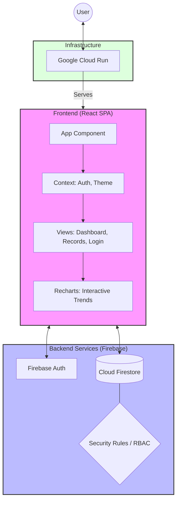

# My Ledger - Secure Financial Management Portal

A high-performance, production-grade financial tracking application built with **React**, **TypeScript**, and **Firebase**. Designed for precision, security, and real-time data exploration.

## 🚀 Core Requirements & Implementation

### 1. Real-Time Financial Dashboard
*   **Requirement:** A centralized hub for monitoring fiscal health at a glance.
*   **Achievement:** Developed a dynamic dashboard featuring high-contrast KPI cards for Income, Expenses, Net Balance, and Transaction counts. Used `recharts` to provide a 6-month trend analysis and a categorical spending breakdown.

### 2. Interactive Data Exploration (Zoom & Pan)
*   **Requirement:** Ability to drill down into specific time ranges within financial trends.
*   **Achievement:** Enhanced the Trend Analysis chart with **Drag-to-Zoom** functionality using Recharts `ReferenceArea`. Integrated a **Brush** component for seamless panning across large datasets and a one-click **Reset Zoom** feature for quick navigation.

### 3. Secure Multi-Factor Authentication
*   **Requirement:** Robust user onboarding and secure access management.
*   **Achievement:** Integrated **Firebase Authentication** supporting both Google OAuth and Email/Password flows. Implemented a custom **Password Reset** flow with automated email dispatch to ensure account recoverability.

### 4. Granular Role-Based Access Control (RBAC)
*   **Requirement:** Differentiated access levels for Admins, Analysts, and Viewers.
*   **Achievement:** Architected a secure user profile system in **Firestore**. Enforced strict **Security Rules** that validate operations based on user roles, preventing unauthorized data modification or privilege escalation.

### 5. Persistent Dark & Light Modes
*   **Requirement:** A modern, accessible UI that adapts to user preferences.
*   **Achievement:** Built a custom `ThemeContext` with `localStorage` persistence. Styled the entire application using **Tailwind CSS** utility classes, ensuring consistent contrast and aesthetic appeal across both themes.

### 6. Real-Time Data Synchronization
*   **Requirement:** Instant updates across all connected clients without page refreshes.
*   **Achievement:** Leveraged Firestore's `onSnapshot` listeners for both user profiles and financial records. This ensures that any change made by an Admin is instantly reflected on an Analyst's dashboard.

---

## 🏗 Architecture Diagram



## 🛠 Tech Stack

*   **Frontend:** React 18, TypeScript, Vite
*   **Styling:** Tailwind CSS, Lucide React (Icons)
*   **Animations:** Motion (formerly Framer Motion)
*   **Charts:** Recharts (D3-based)
*   **Backend/DB:** Firebase (Auth, Firestore)
*   **Deployment:** Google Cloud Run

## 📦 Getting Started

1.  **Clone the repository:**
    ```bash
    git clone https://github.com/your-username/my-ledger.git
    ```
2.  **Install dependencies:**
    ```bash
    npm install
    ```
3.  **Configure Firebase:**
    Create a `firebase-applet-config.json` in the root with your Firebase project credentials.
4.  **Run Development Server:**
    ```bash
    npm run dev
    ```

## 🛡 Security & Compliance

*   **Firestore Rules:** All data access is governed by strict server-side rules.
*   **PII Protection:** User emails and sensitive data are scoped to the authenticated owner.
*   **Input Validation:** All financial entries are validated for type, range, and schema integrity.

---

*Built with precision in Google AI Studio Build.*
