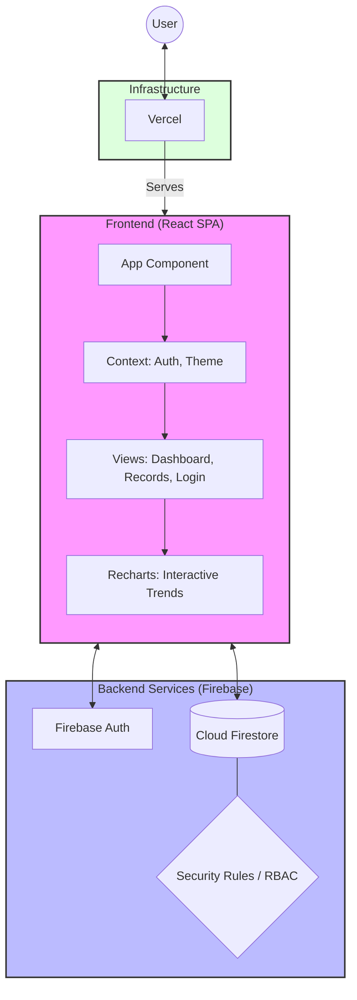

# My Ledger: Financial Management Dashboard

A high-precision, role-based financial management system with a dark editorial aesthetic.

A high-performance, production-grade financial tracking application built with **React**, **TypeScript**, and **Firebase**. Designed for precision, security, and real-time data exploration.

## 🚀 Core Requirements & Implementation

### 1. Real-Time Financial Dashboard
*   **Requirement:** A centralized hub for monitoring fiscal health at a glance.
*   **Achievement:** Developed a dynamic dashboard featuring high-contrast KPI cards for Income, Expenses, Net Balance, and Transaction counts. Used `recharts` to provide a 6-month trend analysis and a categorical spending breakdown.

### 2. Interactive Data Exploration (Zoom & Pan)
*   **Requirement:** Ability to drill down into specific time ranges within financial trends.
*   **Achievement:** Enhanced the Trend Analysis chart with **Drag-to-Zoom** functionality using Recharts `ReferenceArea`. Integrated a **Brush** component for seamless panning across large datasets and a one-click **Reset Zoom** feature for quick navigation.

### 3. Secure Multi-Factor Authentication
*   **Requirement:** Robust user onboarding and secure access management.
*   **Achievement:** Integrated **Firebase Authentication** supporting both Google OAuth and Email/Password flows. Implemented a custom **Password Reset** flow with automated email dispatch to ensure account recoverability.

### 4. Granular Role-Based Access Control (RBAC)
*   **Requirement:** Differentiated access levels for Admins, Analysts, and Viewers.
*   **Achievement:** Architected a secure user profile system in **Firestore**. Enforced strict **Security Rules** that validate operations based on user roles, preventing unauthorized data modification or privilege escalation.

### 5. Persistent Dark & Light Modes
*   **Requirement:** A modern, accessible UI that adapts to user preferences.
*   **Achievement:** Built a custom `ThemeContext` with `localStorage` persistence. Styled the entire application using **Tailwind CSS** utility classes, ensuring consistent contrast and aesthetic appeal across both themes.

### 6. Real-Time Data Synchronization
*   **Requirement:** Instant updates across all connected clients without page refreshes.
*   **Achievement:** Leveraged Firestore's `onSnapshot` listeners for both user profiles and financial records. This ensures that any change made by an Admin is instantly reflected on an Analyst's dashboard.

## 🏗 Architecture Diagram

## Technical Details
- **Framework:** React 19 + Vite.
- **Routing:** React Router v6 with Protected Routes.
- **State Management:** React Context for Auth/Role state.
- **Charts:** Recharts for trend and allocation analysis.
- **Motion:** motion/react for staggered animations and crisp transitions.

## Running the Project
1. `npm install`
2. `npm run dev`

## API Mode
The application currently uses **Mock Data** by default (defined in `src/api/mockData.ts`). 
To switch to the live backend, set `USE_MOCK = false` in `src/api/index.ts`.

## Design Decisions
- **Hidden UI:** Unauthorized actions (like 'Edit' or 'Delete' for Viewers) are not rendered at all to maintain a clean interface.
- **Uncompromising Typography:** System fonts are completely avoided in favor of the editorial pairing to reinforce the "precision instrument" feel.
- **Grid-Breaking Elements:** Subtle rotated watermarks are used to add visual interest to the rigid grid layout.
